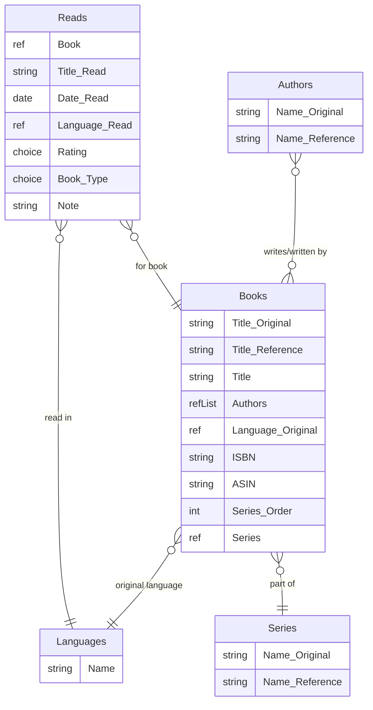

# Grist tables schema

```mermaid
erDiagram
    Authors {
        string Name_Original
        string Name_Reference
    }
    Books {
        string Title_Original
        string Title_Reference
        string Title
        refList Authors
        ref Language_Original
        string ISBN
        string ASIN
        int Series_Order
        ref Series
    }
    Languages {
        string Name
    }
    Reads {
        ref Book
        string Title_Read
        date Date_Read
        ref Language_Read
        choice Rating
        choice Book_Type
        string Note
    }
    Series {
        string Name_Original
        string Name_Reference
    }

    Authors }o--o{ Books : "writes/written by"
    Books }o--|| Languages : "original language"
    Books }o--|| Series : "part of"
    Reads }o--|| Books : "for book"
    Reads }o--|| Languages : "read in"

```
